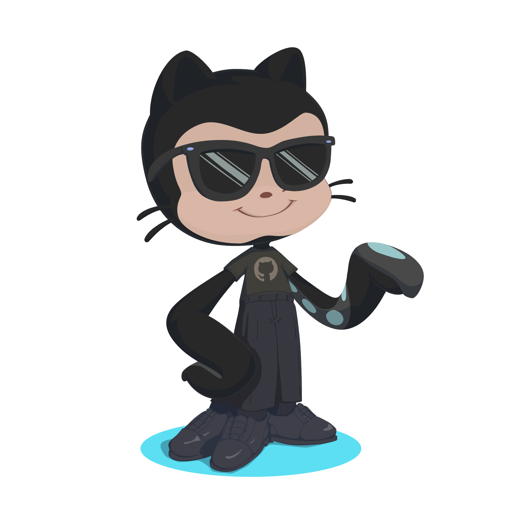

 

# Olá, meu nome é Delson, estudante de programação Web full stack no IOS

### Tecnologias que estou aprendendo: 

 

### Econtre-me:

 

 

  
  

</img>

   

## SOBRE MIM:

 
Entusiasta de desenvolvimento web full stack, em formação no IOS. Futuro engenheiro de software back-end. Habilidades em solução de problemas e oratória são meus pontos fortes.

## MEU OBJETIVO:

 Meu objetivo é me tornar um engenheiro de software especializado em back-end.

</img>
